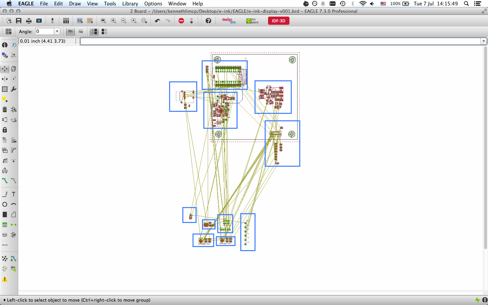
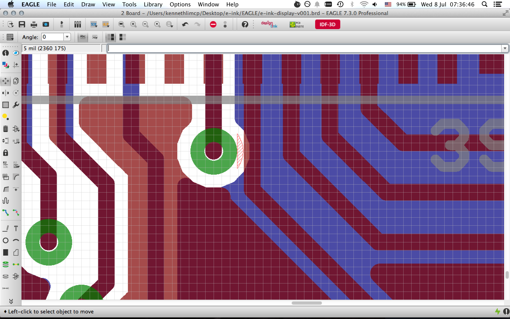
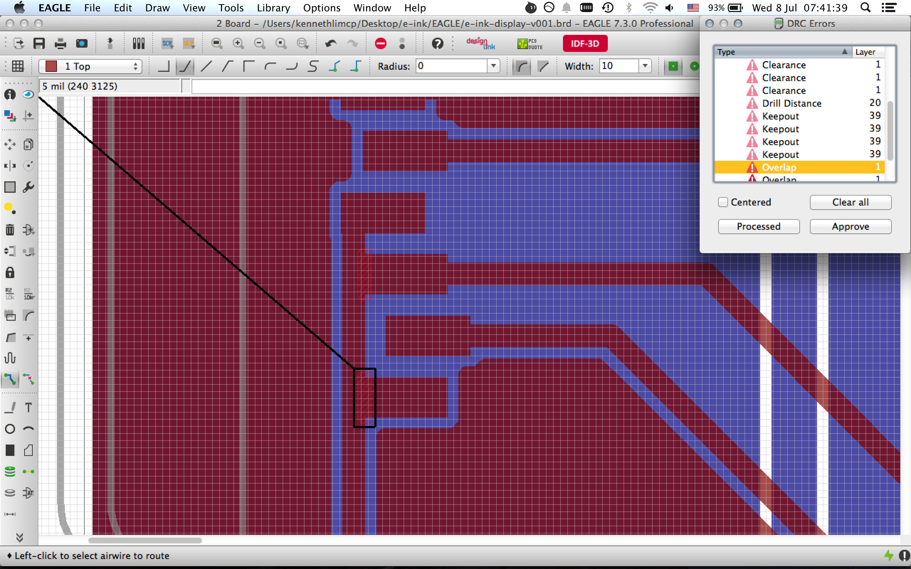
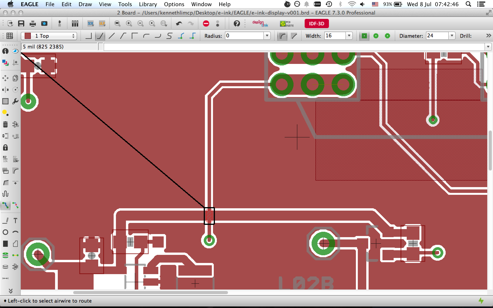

EAGLE tips and advice
---

###Grouping things up

If you are a beginner, switching over to the Board view with a whole bunch of components clustered together might be overwhelming. The recent project i worked on has close to 100 components and that required me to do something about it before even beginning to do routing work.

What it did was to refer to the schematic and move things that are supposed to be together...together.

This is helpful when bypass/decoupling capacitors go to the correction section and placed at where they are designed to be.

###Running a DRC after initial routing

This is a pretty useful tool and a MUST use. Here's some examples of the errors detected by the tool recently.

**insufficient clearance between a via and trace**

**trace touching pads along the way**

**trace cutting acrossing another trace**

