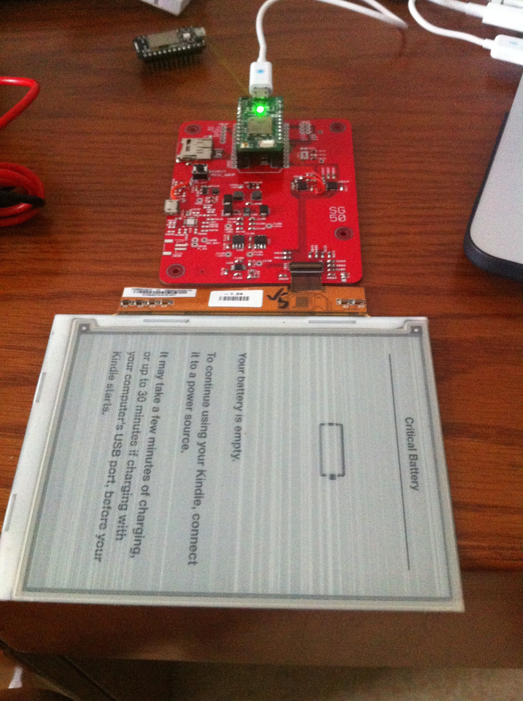

#Wifi E-ink display
----------

###Introduction

The main motivation for this device comes from the regular use of 16x2 or nokia old-style LCD display. They are nice but too small for a sizeable project that requires a simple but viewable display from a distance.

This also challenges me to try out FPC connector that i have never handled before and at the same time design an entire system comprising from power to display signal driver.

The current revision of **V0.0.3** does not work as the I2C GPIO expander is unable to toggle the control pins at `us` resolution so a re-design has to be done. **V0.1.0** is a WIP to improve **V0.0.2** but is only a WIP and is not a working board as well.

####Power system

- USB +5V or single cell Li-ion
- Battery charging and simultaneous system supply
- 3V3 buck converter for primary rail

#####Input options
- microB USB
- jumper wire (+ and -)

#####E-ink supply notes

A LT1945 DC/DC converter is powered by VBAT from the 1-cell li-ion battery to provide the +22V and -20V required for the Gate supply. The next power stage comprises of a simple LDO (LM78(79)/L15) to generate +15V and -15V for the Source supply. There's a LTSPICE file available in this repository that shows the performance of the LT1945 through simulation. This design comes from the datasheet and the components have been properly sized to have beefy ratings.

There are newer ICs in the market that handles the entire power generation required to drive an e-ink display and they should be utilized in the new revision if they can be bought easily in the market. Otherwise, replacing the LDOs might be a considering to achieve better low power consumption in sleep mode.

VDD and VSS supply for the e-ink is powered using a GPIO as the current draw (according to the notes) is only 1mA and this allows up to turn off the display for power saving.

The SMPS power input is controlled using a simple P-channel Mosfet load switch technique to cut off supply when it is not required.

#####Battery power management design

After much sourcing and finding a part available in the Chinese market, I found the BQ24075 suitable for the job that provides a good mix of features. This IC allows a maximum input voltage of 28V and comes with over-voltage protection! No external inductor is required (compared to BQ24260). There's also 2 status signal that allows the MCU to know if there's an external power source connected and whether the battery is currently charging. This allows us to change the "power mode" of the device with faster go-to-sleep timing when there is not power source attached.

This addition low-cost circuit footprint is added for variety. A MCP7381T is used to charge a single cell Li-ion and the VBAT is directly fed to the system. This, however, does not allow the system to be powered up if a battery is not present.

####Driver design notes

The e-ink display requires a fair bit of control pins and part of the reason is not fully understanding which pins are in use and necessary for driving. Therefore, to ensure a higher success rate during rev. 0.0.2, consideration is made to hook up all the exposed pins. Pins that are pulled high and low are also wired up with 0 ohm resistors for flexibility to test their purpose or change the pull voltage.

One design considered is to use 2 x 8 GPIO expander; one for the 8 bit data and another for the seldom toggled controls pins. There are 16 port GPIO expander in the market but having the data pins and control pins independent of each other during writes prevents accidental toggling of the incorrect pin that may result in a damaged display.

Another design is to use a separate MCU that connects directly to all the pins available but most of the Arduino options have low FLASH and RAM. The next notch up would result coding in C (MCU running some RTOS) which is too much to handle at this point in time.

The GPIO expander design is implemented for the initial rev to bring up the board with a Spark Core/Photon that is a beefier Arduino variant that allows us to avoid the low level path for now. Using an external MCU would definitely be a better path to take in future revisions. INT pins are not wired up as all the pins are used as OUTPUT.

####Peripherals

These are implemented in rev 0.0.2:

- Accelerometer to determine screen orientation
- Temperature sensor, duh
- microSD card

future considerations:

- Gyrosensor (why?)
- BLE module (good for proximity control)
- light sensor for ambience detection

####Casing

A laser cut casing would be great to house a useful demonstration set and avoid risk of damaging it from the hands of others!

####Future expansion

- Use e-ink display driver IC
- Add in IR touch sensing technology used in latest Kindle
- Backlight will be awesome much

####Lessons learnt

- Creating new footprints confidently (39-pin FPC connector, QFN-20)
- ULP script "bom.ulp" available to generate the BOM for a project. Makes it easier to manage the ever changing list of components
- ULP script "Unrouted" from Sparkfun will be useful instead of manually browsing through unrouted layer (but not that helpful..)
- need to turn on `STOP` for vias to be exposed without soldermasking
- Forgotten about teardrop ULP
- increase isolate for polygons to 0.012". Sparkfun says that would result in better yield instead of possible short
- it seems like we need to turn on the layers of concern during DRC or it will be missed out. Some silkscreen labels were "violating" some pads/vias and went unnoticed

**v0.0.2**

- need to add thermal vias for battery management IC
- updated battery related ICs label with additional "0" prefix (U01B, U02B, U03B, U04B, U05B)
- `SMPS_CTRL` pin for the LT1945 can only work without populating R12B as the GPIO port on the expander cannot be configured as an open drain to support the pull-up resistor. Have to set in code to use internal pull-up instead. Will need to consider adding an SOT-23 NPN transistor to control the on/off.
- BQ24072/3/4 might better with lower OUT voltage for next stage +3V3 step down
- Use 2K Ohm for R08B to set ILIM for BQ24075
- missed out "insert here" label for J02S
- SJ1 solder jumper can be smaller
- keepout for U03M needs to be included in the design consideration and GERBER generation
- changed OSHW logo to customized for it to be an exposed shiny silver logo :)
- made "SG 50" font a vector, 20% ratio
- incorrect J02M label, was flipped

- spaced out components to be more hand-solderable
- extend the USB pads to be more hand-solderable
- added slide switch
- RST for MCP23008-E needs to be externally biased
- R0xx should be wired to +3V3 instead of EINK_VDD
- some issue with +20v where voltage is present even when disabled

####Resources

Understanding the wiring for e-ink display would not be possible with the information shared by two pro open-source gentlemen.

- [essential scrap](http://www.essentialscrap.com/eink/index.html)
- [SpriteMods](http://spritesmods.com/?art=einkdisplay)
- [Ti Dev board](http://www.ti.com/tool/TIDM-LPBP-EPAPER)
- [SSD1606 driver](http://www.lcd-module.de/fileadmin/eng/pdf/zubehoer/ssd1606_1_1.pdf)
- [OnSemi driver](http://www.onsemi.com/pub_link/Collateral/ENA2223-D.PDF)
- [Eink reseach paper](http://aoe.scnu.edu.cn/uploadfile/2014/0508/20140508112156532.pdf)
- [STM32L0 discovery board](http://www.st.com/st-web-ui/static/active/en/resource/technical/document/user_manual/DM00118944.pdf)
- [Pebble Time teardown](https://www.ifixit.com/Teardown/Pebble+Time+Teardown/42382)
- [Pebble Watch teardown](https://www.ifixit.com/Teardown/Pebble+Teardown/13319)
- [RePaper code](https://github.com/repaper/gratis)
- [Freescale i.MX50](http://cache.freescale.com/files/32bit/doc/data_sheet/IMX50CEC.pdf)
- [GDE021A1 display project](http://www.jsykora.info/2014/06/epd-display-working/)
- [Amazon Kindle source code](http://www.amazon.com/gp/help/customer/display.html?nodeId=200203720)
- [E-ink display](http://www.buy-lcd.com/index.php?route=product/category&path=2897)
- http://www.eevblog.com/forum/microcontrollers/interfacing-epd-(e-ink)-display-from-kindle-anyone-tried
- [EPSON controller module](http://www.mouser.com/catalog/specsheets/x93ac002_f01__(S4E5B001B00A00_Product_Brief_Rev_1.0)[1].pdf)
- [Epaper shield](http://epapershield.com/index.htm)

- [PVI docs](http://wenku.baidu.com/view/c54385ea6294dd88d0d26b94.html)
- [Epson ppt](http://wenku.baidu.com/view/e451453567ec102de2bd8908.html)

Appnote

- MOSFETS in load switch applications(AND9093D)
- Reverse current/battery protection circuit (SLVA139)
- Resistor decade table (dectable)
- [USB disconnect circuit](https://developer.mbed.org/media/uploads/chris/mbed-005.1.pdf)
- [I2C resistor calculation](http://www.ti.com/lit/an/slva689/slva689.pdf)
